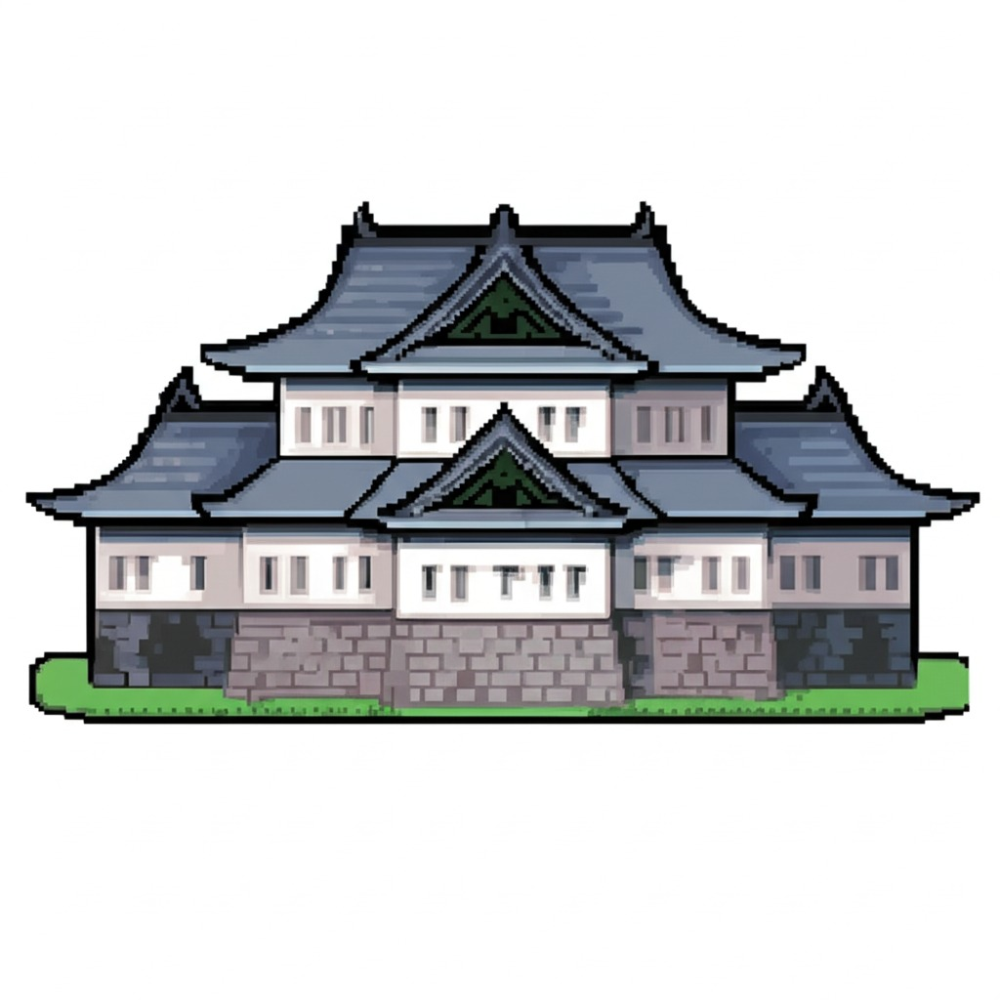
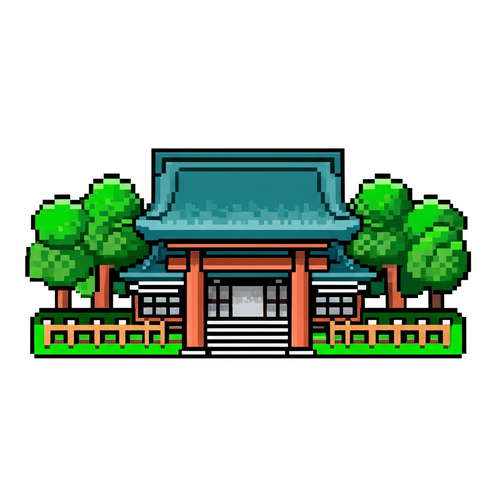
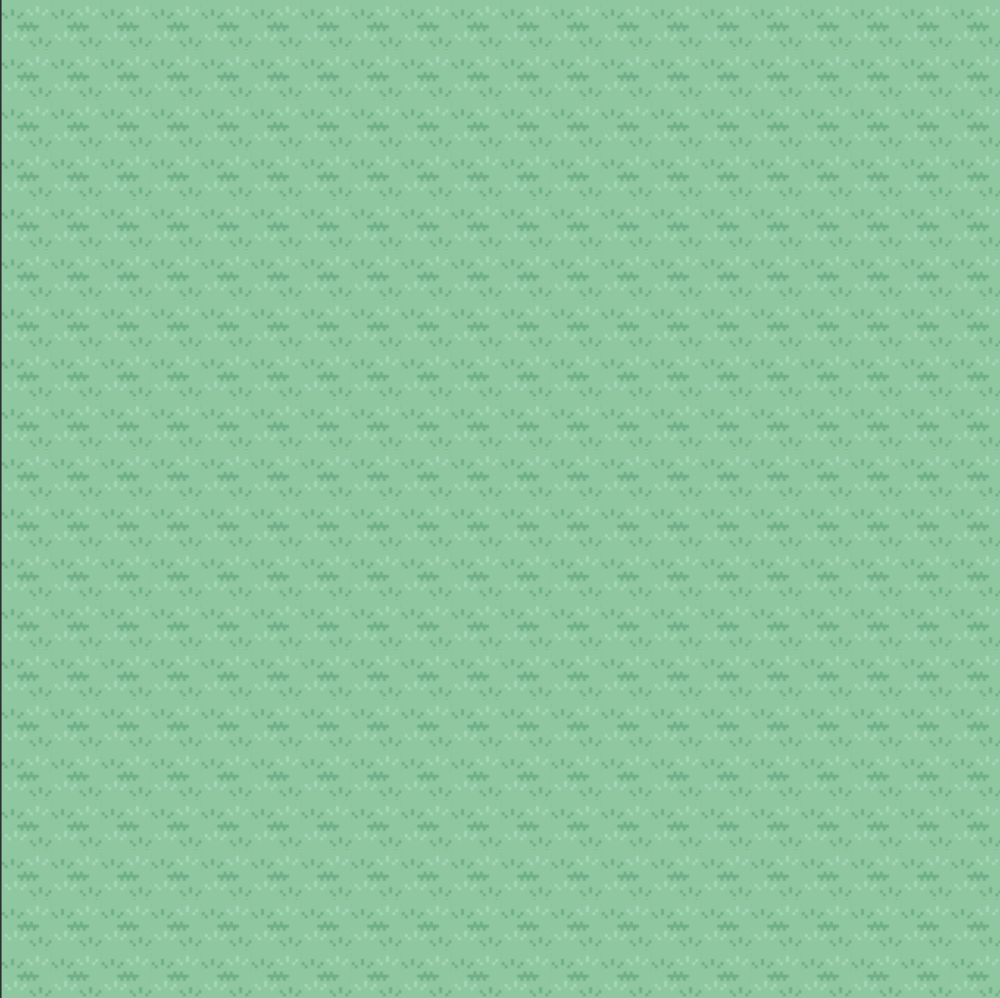
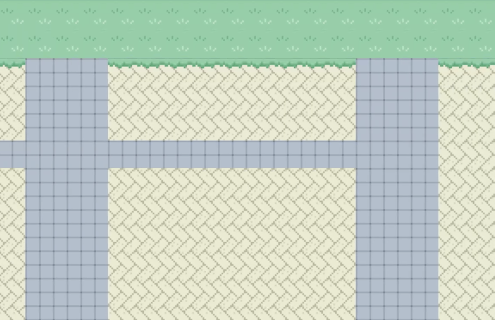

+++
title = "GenAI in Game Assets Generation"
date = 2025-07-31
+++

# How it started

I discovered that GenAI is really good at story telling. But anyone with a laptop can use it to orchestrate a book, like I did in my [previous post](@/blog/01_how_i_use_genai.md). If I were to use it in my next product it would be something novel so it won't be labelled a ChatGPT-wrapper. The idea for a game popped up because at the same time I were learning Rust. I've been loving it so far. Suffice to say, at the time of this writing, this whole blog is powered by [Zola](https://www.getzola.org/), a Rustlings tool. I should do a blog post on Rust. But that for another time. The point is, learning Rust introduces me to a game engine named [Bevy](https://bevy.org). I have dabled in game development with Love2D back in 2020 when I took a class on gaming development. Haven't made any game since but the concepts are still fresh in my mind. You get a game engine, load some image sprites, put some codes in to give some controls, add a story line and some quests then bam, you have a game. Well sort of.

I'm a millenial. I grew up in the 90s where Gameboy Advance games were popular among us. The most popular ones were the Pokemon core series where the main player travel around the worlds catching pokemons, train them and have them battle other trainers' pokemons to become the champion. We had an online community 'forum' back then where we discussed different strategies and ways of playing. There were a lot of fan-made games that used the contents from the main ones. I thought it was really cool to be able to make a game yourself like that. One day, I got this idea about incorporating the real world into a pokemon game so the player can travel around and learn about diffrent cultures and stories in the real world, not a fictional one. The problem was, I didn't know how to make those contents for other countries. As a kid I barely travelled outside of mine. So this was supposed to be a team effort, not just me. So I opened a 'forum thread' calling for participants. A lot of people loved the idea. A few of them joined me initially. Then came the 2nd problem. I did not know where to start. I wasn't a coding wizard back then. I didn't know how to rip/port a game, or putting them together for a game engines, if they existted back then. But without any technical expertise, the team eventually fell apart. Everyone moved on.

Fast forward to 2025. We have GenAI that could crank out novel stories that could resemble the real world in seconds, game engines that make the development process much better. I also have game development experience under my belt. It would be a crime against my childhood self not to start. We won't be making Pokemon game exactly, as I don't like the possibility of Nintendo lawyers knocking on my door. But we would still be making an open world RPG that resembles the real world - our world that we are living in.

# How it works

## Game Engine Concept
As mentioned before, a game generally consists of components like image sprites, tiles, text dialogues, etc. We call them assets. Beside those assets we also need codes to dictate how those images move accross the screen and interact with the player. Below are some of the examples:
- An NPC walking to the player: the engine would translate the NPC sprite image from the edge of the screen to the player at the center.
- That NPC begins talking, a dialogue box appears at the bottom of the screen with texts running as they speak: the engine would load the dialogue message, which is a game asset. Then animate that message in the box.
- A landmark appears in the scene: the engine would load the image sprite that represents the landmark.

## How game assets are built

Normally, all those game assets (and codes) are pre-defined and packaged altogether. Your game would have everything it need to run offline without futther inputs. But for our games it impossible for me to make all those assets, considering the fact that our world is huge. It's also very likely that the players are not going to visit all of the locations, making it wasteful to package everything beforehand. Therefore, we will only generate assets **on the go**. Here's a high level example:

Suppose the player is visiting Tokyo, Japan. To create a unique scene of the location, we will generate image sprites that repensent the landmark in that location. How does a game engine knows what landmarks are in Tokyo, or any other cities in the world? Well it can also prompt an LLM. The prompt can be crafted by the game engine itself.

> Prompt: Give me a list of all the landmarks in Tokyo, Japan.

> Answer (Structured Output): ["Imperial Palace", "Meiji Jingu"]

I won't commend the answer given by GenAI. Everyone knows that it's great when asked for knowledge questions like this. But what truly make it even more amazing than it already is is the ability to format its own answer as a [structured output](https://ai.google.dev/gemini-api/docs/structured-output), in this case a list of string items. This allow me to effectively follow up with image prompts.

> Prompt: Generate an image sprite of the Imperial Palace in Tokyo, Japan.

> Prompt: Generate an image sprite of the Meiji Jingu in Tokyo, Japan.

And you'd get these 2 images as result.

Imperial Palace                         |  Meiji Jingu
:--------------------------------------:|:------------------------------:
|

Note that the actual prompts are more complicated than these. You have to specify styles and artistics. But you get an idea of how the flow works. Below is the pseudo-code in python.

```python
LOCATION = "Tokyo, Japan"

def structured_prompt(prompt: str, output_format):
    '''Make requests to LLM service and parse result as output_format'''

def image_prompt(prompt: str):
    '''Make requests to LLM service and parse result as image format'''

def main():
    landmarks = structured_prompt(f"Give me a list of landmarks in {LOCATION}", output_format=list[str])
    images = [image_prompt(f"Generate an image sprite of the {landmark} in {LOCATION}") for landmark in landmarks]
    game_engine.load_assets(images)
```

## Building tiles layer

Now that we have those image sprite dynamically generated, we need to put them into our game. But we can't just put them into blank space. We need some kind of foundation layer in the background. In our case we need to lay down some tiles, like the 4 grass tiles below.


If you are not familiar with game development, you'd be confused. These are 4 tiles, each of them are 32x32 pixels. But anyone of them, used repeatedly, could build the ground layer for the whole world. For example if we pick the first one, and put up a 20x20 tile sheet (640x640 pixels). Below is part of the Bevy codes that spawn them followed by the result.

```rust
fn setup(mut commands: Commands, asset_server: Res<AssetServer>) {
    commands.spawn(Camera2d);
    commands.spawn((
        Sprite {
            image: asset_server.load("tiles/grass_tiles.png"),
            texture_atlas: Some(TextureAtlas {
                layout: asset_server.add(TextureAtlasLayout::from_grid(
                    UVec2::splat(32),
                    8,
                    161,
                    None,
                    None,
                )),
                index: 1,
            }),
            custom_size: Some(Vec2::splat(32.0 * 20.0)),
            image_mode: SpriteImageMode::Tiled {
                tile_x: true,
                tile_y: true,
                stretch_value: 1.0,
            },
            ..default()
        },
    ));
}
```



For more information or examples you can look into the [Bevy documentation](https://bevy.org/examples/2d-rendering/sprite-tile/). It's worth saying that I didn't graphically create these tiles myself. They are parts of the portfolio of [Ekat99](https://www.deviantart.com/ekat99). They have lots of awesome works, especially for Pokemon games.

Can we use GenAI to graphically generate the tile images? It turns out to be really hard for LLM to generate a singular tile that can be used repeatedly. The current models are trained to generate pictures of scenery, places, humans, objects, etc. An abstract 32x32 tile that represent nothing but a blade of grass. When I prompt for that I often get back a whole picture of a grass scene with flowers and trees and even animals in it. That's not useable in this game setting so I resort to using tiles the traditional way, prepackaged.

But wait, in game there isn't just 1 tile that make the entire world. It would be boring if you see grass everywhere you go. You need to see some roads, bricks, flowers, etc. Maybe a lamb post here, a pretty fence there. There should be mountains, and lakes and river and tundra and lava and whats not. If we are not using GenAI to create those images, can we use it to dictate how they are layered?

This is where it gets more complicated than generating landmarks. Let's say you have a perfect model that gives you the perfect answer everytime. It's not possible to generate Rust codes **on the go**, because all codes must be loaded when you compile the app, unless it's a separate program that is in charge of generating the Bevy codes. Another way to dictate how the tiles are layered withtout using Rust is to use the config `.tmx` file, which I considered as another kind of assets. The file has an XML format and the main part of the file is like csv format. Here's an example of a 10x10 tilesheet.

```
0,0,0,0,0,0,0,0,0,3
0,0,0,0,0,0,0,0,0,3
0,0,0,0,0,0,0,0,0,3
2,0,0,1,0,0,0,1,0,3
0,0,0,0,0,0,0,0,0,3
0,0,0,0,0,0,0,0,0,3
0,0,0,0,1,0,0,0,0,3
0,0,0,0,0,0,0,0,0,3
0,2,0,0,0,0,0,1,0,3
0,0,0,0,0,2,0,0,0,3
```

Then inside the same file we define 0 -> grass tile, 1 -> flower tile, 2 -> squirrel, 3 -> fence. You get the idea. I did try to use GenAI to generate the `.tmx` file but it would hallucinate like crazy. At some point it created a very long number that could not be loaded into the game engine.

So I'm back to the 'traditional' way and generate those tiles using hard-code and algorithm. In game development we have a term for that - procedural generation. This is a whole other topic and I will save that for another blog post. But the gist is that it let you generate tile layout following a specific predefined pattern. So your world can be more than just a single grass tile, but everything is in order. For example when I used it to layer roads and brick tiles to make the place more city-like. You can see the roads are straight. In addition, there's the city edge where bricks meet grass tiles.



# The end result

Now that we have the foundation, and the building image sprites. We can place them into our game.


Thank you for reading.
