+++
title = "Story Development"
date = 2025-08-07
+++

I used to think that blogging is a time sinker. After all you've got to spend time to:
1. Research a topic for your post.
2. Present it in a way that is digestible and understandable for your audience.

All you get in return is the knowledge you acquire from doing step `1.`, and by that time you would always feel lazy to do step `2.`. However, when working on this blog I no longer think that is true (otherwise you wouldn't be reading this). Blogging, like taking a stroll in the park, can be a great way to organize your thoughts when you are working on the project. I used to be that guy (still am sometimes) who would dive into coding the instance I get assigned. The more senior I get, the more I realize how unhealthy that is. It's like playing competitive sports without any strategy, or writing books without direction. Though it can be fun to start something new right away, not knowing where you're headed can be detrimental.

The same motif applies when you're developing story line for a game. Even when your story is dynamically generated by LLM. When you write a book, you start from a main objective summary. Then you outline your sub topics. Once all of those are finished then you can finally start writing for each part. When you 'hire' an LLM to do that for you, it's important to keep them in the same process. This is a lesson I learned from developing this game. I probably have rewritten the game rules several times because I didn't have a clear structure for how the story should be developed.

Therefore, I'm taking a step back from coding, and spend some time for this blog post where I tell the story of how I use GenAI to develop game stories.

# Starting from an objective

First off, you'd need to have a clear definition for your game. For my game I want it to be a treasure hunting quest, on a simulated world that resembles our own. The player would search for that final treasures while traveling around the world, and pick up some mini treasures along the way. So the very first task of the game AI is to set the hidden place of our main treasure and build a lore around it. Below's an example. We will use structured output for easier parsing later.

> Prompt: You are a game story writer. Your job is to design a story flow for a treasure hunting game that takes place in the real world (with countries and cities). Please write a main storyline about the final treasure that is hidden away in a landmark in the world.

> Answer:
```json
{
    "name": "The Obsidian Heart of Aztlán",
    "landmark": "Pyramid of Quetzalcoatl, Xochicalco",
    "place": "Cuernavaca",
    "country": "Mexico",
    "story": "For generations, whispered legends have circulated among the oldest indigenous communities of Mexico: tales of the Obsidian Heart of Aztlán, a pre-Columbian artifact said to be carved from the purest volcanic glass, infused with the wisdom and spirit of the ancient Aztec emperors. It is believed to possess the power to unify tribes and reveal forgotten knowledge. During the Spanish Conquest, fearing its destruction or misuse, a small band of priests and elite warriors from Tenochtitlan entrusted it to a clandestine sect of scholar-shamans, who transported it south, far from the escalating conflict. They sought refuge within the labyrinthine ruins of Xochicalco, a strategic, fortified city once home to a highly advanced pre-Hispanic civilization. According to ancient glyphs discovered by your eccentric archaeologist mentor before his disappearance, the Obsidian Heart was secreted away within the heart of the Pyramid of Quetzalcoatl, a place where celestial alignments and earthly power converged. The last entry in your mentor's journal hints at a final guardian, a descendant of the original protectors, who holds the key to its location – and to a prophecy concerning a dire threat to the balance of the world. Finding this guardian and convincing them to reveal the Obsidian Heart is the ultimate challenge, requiring not only decoding ancient riddles but also proving oneself worthy of its immense power and protecting it from a shadowy organization known as 'The Serpent's Coil', which seeks to exploit its abilities.",
}
```

If you're wondering if this example would spoil the game as now we all know the treasure is going to be in Mexico, don't be. As you certainly are going to get a different result when you run the game. This is my intention for replayability. Every time you play the main treasure is going in a different place.

Fun fact, the first time I ran this game the treasure was hidden in a Pyramid in Cairo, Egypt. Well I thought nothing could be more predictable than that. So I adjusted the temperature for this prompt model to be 2.0, allowing the LLM to be more 'creative'.

# Down to smaller sub topics

## Level 2 - intro message

Now that we have the main story going. How can we make sure the rest of the sub-stories would follow through? You might be tempted to 'concatenate' the main story into the next prompt. For example if you want to GenAI an introduction message that will be displayed to the player when they first start the game. DON'T do this

> Prompt: Write a welcome message to the player when they first start a treasure-hunting game. Here's the game main story: {insert_main_story}

I'm not saying it's wrong. You could still get a very good result out of this. I'm saying it's inefficient. First off, you lose the first prompt that explains the game mechanics. Secondly, if you ever go beyond this the 2nd level, for example:

> Prompt: Based on the intro message {insert_intro_message} and the main story {insert_main_story}. Develop the NPCs that would support the player through their journey in a treasure hunting game.

> Prompt: Based on the intro message {insert_intro_message}, the main story {insert_main_story}, the NPC background {insert_NPC_background}. Write the first message that the NPC would say to the player.

> Prompt: Based on the first message of, wait, what are we talking about again?

You can see where this is going right? Bloated prompts (is that a thing?) that make your codes unmaintainable and give your AI brain damages.

Fortunately, Gemini allows [multi-turn conversation](https://ai.google.dev/gemini-api/docs/text-generation#multi-turn-conversations). It works like you are chatting with the AI using the web user interface. Here's what the (simplified) input looks like

```json
[
    {
        "role": "user",
        "parts": [
          { "text": "Develop main story for a treasure hunting game." }
        ]
    },
    {
        "role": "model",
        "parts": [
          { "text": "For generations, whispered legends have circulated among the oldest indigenous communities of Mexico..." }
        ]
    },
    {
        "role": "user",
        "parts": [
          { "text": "Write an introduction message to welcome the player to the game. Hint at the location of the treasure." }
        ]
    }
]
```

This way if you want to prompt further while keeping the old contents, all you need is to 'append' a new JSON object into your payload, instead of 'concatenating' all the previous messages into 1 prompt.

## Beyond level 2 - regional stories 

What if you need to branch off, aka develop a different storyline that has nothing to do with the intro message, but still need to be on track of the main story. In my game there are going to be small quests depending on the location that the player chooses to start off. In that case you just need to keep the first main story parts and replace the last part.

```json
[
    {
        "role": "user",
        "parts": [
          { "text": "Develop main story for a treasure hunting game." }
        ]
    },
    {
        "role": "model",
        "parts": [
          { "text": "For generations, whispered legends have circulated among the oldest indigenous communities of Mexico..." }
        ]
    },
    {
        "role": "user",
        "parts": [
          { "text": "Develop a mini story about searching for small treasures that involve the landmarks in Tokyo, Japan." }
        ]
    }
]
```

And if you want to develop further into the NPCs
```json
[
    //... First 3 parts same as above
    {
        "role": "model",
        "parts": [
          { 
            "text": {
                "name": "The Shogun's Secret Sake",
                "landmark": "Meiji Jingu Shrine",
                "story": "The last Shogun, Tokugawa Yoshinobu, was a man of modern tastes. He created a special blend of sake to be enjoyed while looking towards the future, but the recipe was lost. ",
            }
          }
        ]
    },
    {
        "role": "user",
        "parts": [
          { "text": "Develop some NPCs to support our player in their side quest" }
        ]
    },
    {
        "role": "model",
        "parts": [
          { "text": [
                "Kaito (The Phantom Historian): Communicates only through encrypted messages and burner phones. Kaito is your primary guide, providing riddles and historical context. Their identity is a mystery. Are they a hero or using you for their own ends? They often leave clues for you in old bookshops or tucked away in unexpected places.",

                "Ms. Chiyoko (The Temple Guardian): An elegant, elderly woman who is a lay attendant at the Senso-ji Temple. She appears to be a simple, kind-hearted guide, but she possesses a surprising depth of knowledge about secret societies and codes. She may offer cryptic advice or a seemingly innocuous item that later becomes a key to solving a puzzle. She is a guardian of a piece of the cipher."
          ] }
        ]
    }
]
```

Now that you have 2 (or more) NPCs, you may have to branch off your prompt again,

```json
[
    //... first 6 parts same as above
    {
        "role": "user",
        "parts": [
            { "text": "Let's say you are Kaito, write your first message to introduce yourself to the player" }
        ]
    }
]
```

```json
[
    //... first 6 parts same as the one before the above
    {
        "role": "user",
        "parts": [
            { "text": "Let's say you are Ms. Chiyoko, write your first message to introduce yourself to the player" }
        ]
    }
]
```
# Overall
Your story prompt flow would generally look like the graph below, plus the part about the landmark image generation.



The graph can still be extended. You might even recognize that it has a tree-like structure. I will write another (more technical) post about how to implement this in Bevy Rust. But that will be for another time.

Thanks for reading.
